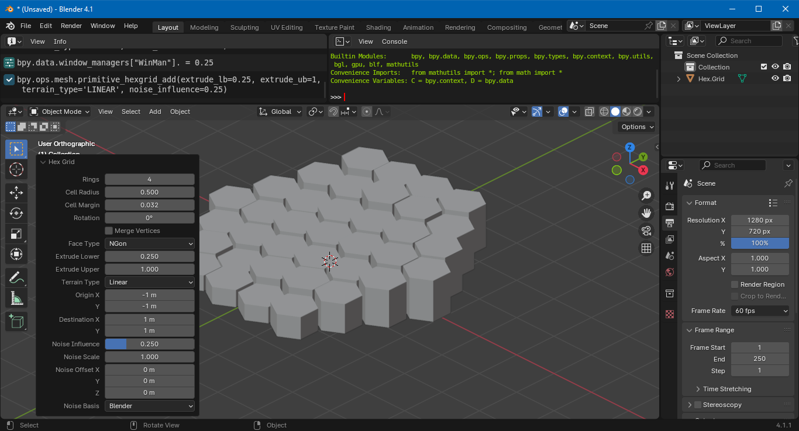
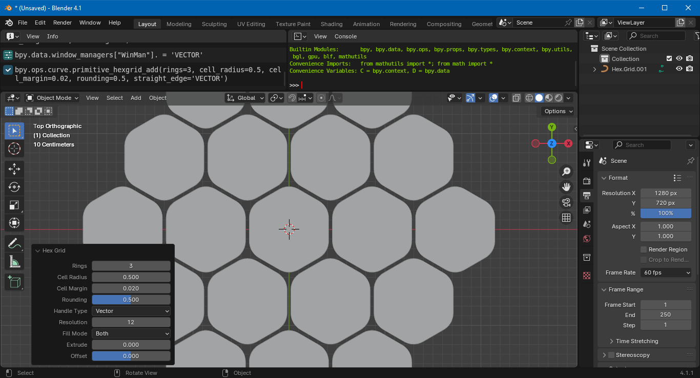

# HexGrid

A Blender add-on to make hexagon grids. In Object Mode, go to `Add > Mesh > Hex Grid`  or `Add > Curve > Hex Grid`.

This developed out from the tutorial "[Scripting A Hexagon Grid Add-On For Blender 2.91](https://behreajj.medium.com/scripting-a-hexagon-grid-add-on-for-blender-2-91-bbcda88850c7)".

🇹🇼 🇺🇦